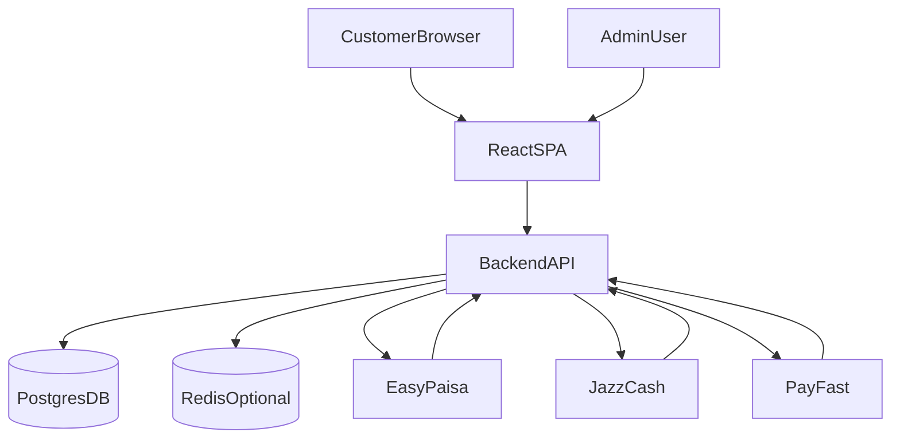
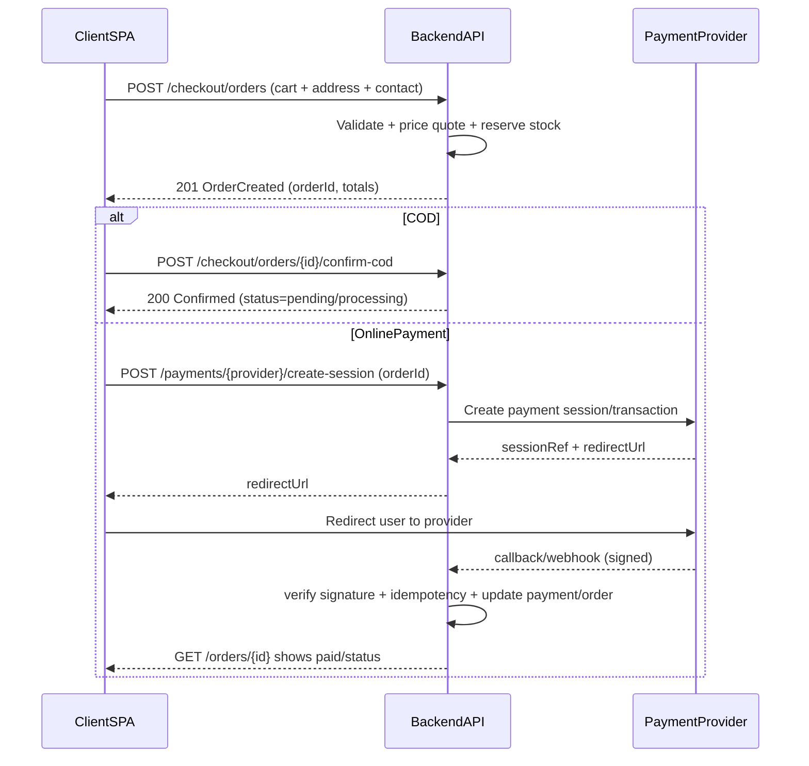

# Royal Orchard E‑Commerce — Full System Plan

This repository currently contains a **frontend-only Vite + React SPA** (client + admin UI) with **mocked localStorage data** (Zustand stores) and **no backend**. This document defines how we will turn it into a production-ready e‑commerce system: backend, database, APIs (client/admin), payment flows, testing, and security hardening.

## 1) Scope & goals

- **Goal**: Ship a production-ready mango e‑commerce platform with:
  - Customer storefront (browse, cart, checkout, account, orders)
  - Admin dashboard (products, orders, customers, analytics)
  - Secure authentication and RBAC
  - Real database persistence
  - Payment integrations: **EasyPaisa**, **JazzCash**, **PayFast** (and **COD**)
  - Testing + CI-grade quality gates
  - Security hardening for common threats (XSS/CSRF, brute-force, webhook replay, injection, etc.)

## 2) Current frontend architecture (as-is)

### 2.1 Routes (source of truth: `src/App.tsx`)

**Client**

- `/` Home
- `/shop` Product listing
- `/product/:slug` Product detail
- `/cart` Cart
- `/checkout` Checkout (currently simulated)
- `/login`, `/signup`, `/forgot-password`, `/reset-password`
- `/account`, `/orders`
- Content/policy pages: `/our-story`, `/freshness`, `/shipping-policy`, `/refund-policy`, `/fruit-care-guide`, `/faq`, `/privacy`, `/terms`, `/security`, `/wholesale`

**Admin (currently client-protected only)**

- `/admin` Dashboard
- `/admin/products`
- `/admin/orders`
- `/admin/customers`
- `/admin/analytics`
- `/admin/profile`

### 2.2 Mocked “backend” in the SPA

- **Products**: static seed list in `src/data/products.ts`
- **Cart**: `src/store/cart.ts` (persisted to localStorage)
- **Auth**: `src/store/auth.ts` (persisted to localStorage, includes hard-coded admin creds; not production-safe)
- **Admin data** (products/orders/customers): `src/store/admin.ts` (persisted to localStorage)
- **Checkout**: `src/pages/Checkout.tsx` currently writes orders into the admin store after a `setTimeout`

## 3) Target system architecture (to-be)

### 3.1 High-level diagram

### 3.2 Backend stack (default)

- **Runtime/API**: Node.js + NestJS (REST)
- **Database**: PostgreSQL
- **ORM**: Prisma (migrations + type-safe queries)
- **Cache/queue (recommended)**: Redis (rate limiting, webhook idempotency locks, OTP/reset throttling, background jobs)
- **Auth**: JWT access tokens + refresh tokens (secure cookie option) + RBAC (`customer`, `admin`)
- **Observability**: structured logs, request IDs, health checks

## 4) Core domain model (database schemas)

The frontend currently stores minimal order/product shapes; production requires normalized schemas + immutable snapshots for orders.

### 4.1 Entities

- **User**
  - `id`, `name`, `email` (unique), `phone`
  - `role`: `customer|admin`
  - `passwordHash`
  - `status`: `active|disabled`
  - `createdAt`, `updatedAt`, `lastLoginAt`
- **Address**
  - `id`, `userId`
  - `name`, `phone`
  - `addressLine1`, `addressLine2`, `city`, `province`, `postalCode`, `country`
  - `isDefault`
- **Product**
  - `id`, `slug` (unique), `name`, `tagline`, `description`
  - `variety`, `collection`
  - `active`
  - `createdAt`, `updatedAt`
- **ProductVariant** (weight-based)
  - `id`, `productId`
  - `weight`: `3kg|5kg|8kg`
  - `price` (PKR)
  - `sku` (optional unique)
- **Inventory**
  - `variantId`
  - `stockQty`, `reservedQty`
- **Order**
  - `id`, `orderNumber` (e.g. `RO-2026-000123`)
  - `userId` nullable (guest checkout allowed)
  - `customerName`, `email`, `phone`
  - `shippingAddressSnapshot` (immutable JSON or dedicated columns)
  - `status`: `pending|processing|shipped|delivered|returned|cancelled`
  - `currency`: `PKR`
  - `subtotal`, `tax`, `shipping`, `discount`, `total`
  - `createdAt`, `updatedAt`
- **OrderItem**
  - `id`, `orderId`
  - `variantId` (nullable if variant deleted later)
  - `productNameSnapshot`, `weightSnapshot`
  - `unitPrice`, `qty`, `lineTotal`
- **Payment**
  - `id`, `orderId`
  - `provider`: `COD|EASYPAISA|JAZZCASH|PAYFAST`
  - `status`: `pending|authorized|paid|failed|refunded|cancelled`
  - `amount`, `currency`
  - `providerReference` / `intentId`
  - `paidAt`
  - `rawProviderPayload` (store minimal; avoid secrets; encrypt if needed)
- **WebhookEvent**
  - `id`, `provider`, `providerEventId` (unique per provider)
  - `signatureValid` boolean
  - `payloadHash`, `receivedAt`, `processedAt`
  - Used for **idempotency** + auditability
- **AuditLog** (admin actions)
  - `id`, `adminUserId`, `action`, `entityType`, `entityId`, `before`, `after`, `createdAt`, `ip`, `userAgent`

## 5) API architecture & standards

### 5.1 API conventions

- Base path: `/api/v1`
- JSON only; consistent error format:
  - `{ "error": { "code": "...", "message": "...", "details": ... } }`
- Auth:
  - Access token: short-lived JWT
  - Refresh token: HttpOnly cookie (preferred) or token endpoint with rotation
- **RBAC** is server-side and enforced on every admin route.
- Validation:
  - DTO validation on all write endpoints (and critical read params)
- Pagination:
  - `page`, `pageSize`, `sort`, `q`

### 5.2 Client vs Admin separation

- **Client** uses public/customer endpoints.
- **Admin** uses admin-only endpoints (guards + role checks).
- Some endpoints share the same underlying services, but have separate controllers and DTOs.

## 6) Checkout & payment flows (COD, EasyPaisa, JazzCash, PayFast)

### 6.1 Checkout flow

### 6.2 Key rules

- **Never mark paid client-side**. Payment is only `paid` after verified provider confirmation.
- Webhook security: signature verification + timestamp tolerance + idempotency.
- Order totals are computed server-side (client totals are advisory only).

## 7) Frontend work required (80% → 100%)

We will keep the UI mostly unchanged and replace localStorage stores with API-backed services:

- Replace `src/store/auth.ts` with API auth (keep a small auth/session store).
- Replace `src/store/admin.ts` with admin API calls (React Query).
- Replace `src/data/products.ts` usage with product APIs (optionally seed DB from this file initially).
- Replace checkout `setTimeout` in `Checkout.tsx` with real:
  - create order
  - create payment session (if not COD)
  - handle success/failure states

## 8) Testing strategy

- **Unit tests** (backend): pricing/tax, order transitions, provider signature validation, idempotency.
- **Integration tests** (backend): auth, product CRUD, checkout order create, webhook processing.
- **Frontend**:
  - keep existing Vitest setup; add tests for critical components/services.
- **E2E (optional but recommended)**: Playwright “happy path” checkout + admin order status change.

## 9) Security checklist (must pass before production)

- Auth:
  - Password hashing (argon2/bcrypt)
  - Rate limiting on login/reset
  - Refresh token rotation
- App security:
  - Input validation on all endpoints
  - CORS hardened to expected origins
  - Request size limits
  - No secrets shipped to client
- Payments:
  - Signed webhooks verified
  - Idempotency keys & event replay protection
  - Minimal sensitive payload storage
- Admin:
  - RBAC enforced server-side
  - Audit logs for data-changing actions

## 10) Delivery sequence (implementation order)

1. Create `docs/` deliverables (`plan.md`, `progress.md`, `api.md`)
2. Scaffold backend (`backend/`) + DB tooling
3. Implement schemas + migrations
4. Implement auth + RBAC
5. Implement products + inventory + admin product management APIs
6. Implement orders + checkout APIs
7. Implement gateway integrations (EasyPaisa/JazzCash/PayFast) + webhook processing
8. Refactor frontend to call real APIs (React Query)
9. Add tests (unit/integration; optional E2E)
10. Security hardening + final review

